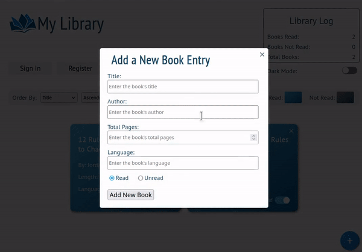

# Library

"... a simple library rolodex'

This project is from [the Odin Project](https://www.theodinproject.com)(specifically, from their [Full Stack Javascript](https://www.theodinproject.com/paths/full-stack-javascript) curriculum). [Click here](https://www.theodinproject.com/paths/full-stack-javascript/courses/javascript/lessons/library) to read more about the project requirements.

## Live App

[Click here](https://mpieciak18.github.io/library/) to check out the live version of the app!

## Project Objectives

1. To create an application that can track & save a user's list of books.
2. To implement user authentication and a database using Google Firebase.

## Technoligies Used

 
 

 

## App Features

1. Responsive, mobile-friendly styling that's simple yet aesthetic.
2. A pop-up that accepts user input for new book entries.
3. Toggle buttons for light-mode/dark-mode and each book's read/unread status.
4. The ability to sort entries by different categories, either asending or descending.
5. Local browser storage for logged-out users.
6. User registration and authetication for users wanting to store their entries online.

## Instructions

1. Click "register" to create an account for online entry storage. Otherwise, skip to store locally.
2. Click the "+" button in the lower-right-hand corner to open the new entry pop-up. Fill out the form with a book you've either already read or would like to read, and then click "add new book" to watch your entry be added to the list.
3. If you'd like to change any given book entry from "unread" to "read", or vice versa, click the toggle-button in the lower-right-hand corner of the book entry tile.
4. If you'd like to switch between light-mode and dark-mode, click the toggle-button in top, beneath the library log stats.
5. To delete a book entry, click the "x" button found in the upper-right-hand corner of the book entry tile.
6. To change the sorting of entries, make your selection the the two drop-down menus found near "order by".
7. Click "log out" to sign out of your account and to access entries found in your local storage.

## Areas for Improvement

1. Not every element is styled appropriately for dark-mode, including buttons, drop-down menus, and user-input fields. Fixing the CSS rules for these elements would make dark-mode nearly perfect.
2. Book entries cannot be edited outside of changing the read-status and deleting them entirely. Add some sort of "click-to-edit" functionality to the book entry tiles' fields would be a huge improvement.
3. There is only one "list" per user. Giving the user the option to create extra "lists" and name them (in a similar spirit to folders in a filesystem) would be a nice upgrade. I.e., a user can have lists titled "default", "school", "book club", etc.
4. Piggy-backing off of #3, being able to share communal lists where multiple users can edit book entries is another cool idea.
5. Finally, based off #3 and #4, being able to comment on book entries in communal lists would be a fantastic way to add interactivity to the app.

## Known Issues

1. Local storage is initialized with 3 sample entries for new users, and then persists indefinitely. Therefore, any entries in local storage (even if each entry is deleted) will always be there upon accessing the app while signed out, unless the user clears their browser cache. This sometimes leads to unpredictable behavior. Adding a time limit (e.g., 3 days) could be an appropriate fix.